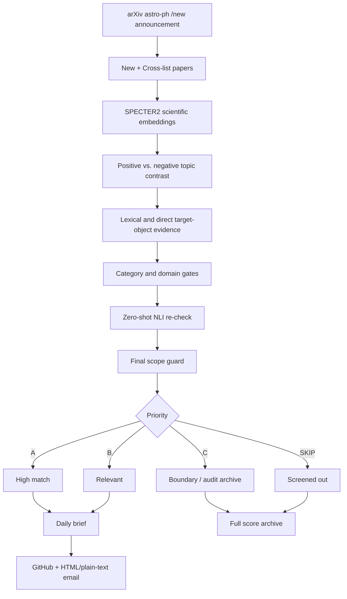

# AstroBrief

**Semantic arXiv screening and daily literature briefs for astronomy research groups.**

AstroBrief reads the official daily `astro-ph` announcement, evaluates the complete New + Cross-list candidate set against a configurable research scope, ranks papers with scientific-language models plus explicit domain guards, and delivers a compact A/B literature brief through GitHub and email.

The default profile is tuned for **Galactic/local interstellar medium (ISM), molecular clouds, cold atomic and molecular gas, dense structures, star formation, turbulence, magnetic fields, chemistry, feedback, high-velocity clouds (HVCs), gaseous halos, and the circumgalactic medium (CGM)**. The scientific scope is configurable through `semantic_topics.json`.

The recommendation engine uses local open models and does **not** require a paid LLM API.

## Why AstroBrief?

A simple keyword alert often has two problems:

1. **False positives:** generic terms such as *shock*, *turbulence*, *feedback*, *magnetic field*, or *halo* also occur in solar, planetary, compact-object, stellar-dynamics, plasma, and unrelated extragalactic papers.
2. **False negatives:** a relevant paper may describe the science using different terminology, appear as a cross-list, or have a primary category that does not obviously match the target topic.

AstroBrief therefore treats paper selection as a **semantic ranking and scope-classification problem**, rather than substring matching alone.

## Production pipeline



## 1. arXiv announcement ingestion

Production ingestion uses the public daily listing:

```text
https://arxiv.org/list/astro-ph/new?show=2000
```

The announcement page is treated as the source of truth for both the **batch date** and **batch membership**. AstroBrief parses all displayed sections, validates the page-level entry count, includes **New submissions + Cross-lists**, and excludes **Replacements** from the screening candidate set.

One page request provides the metadata needed by production: arXiv ID, title, authors, categories, abstract, and announcement date. The current production path intentionally does not depend on the Atom API, which keeps daily ingestion simple and avoids turning a single announcement check into many API requests.

The parser is deliberately strict: malformed section boundaries, incomplete metadata, duplicate candidate IDs, or an incomplete page cause a failure rather than silently producing a partial digest.

## 2. Configurable research scope

`semantic_topics.json` defines the scientific scope. It contains:

- **positive topics** — scientific directions the group wants to see;
- **topic descriptions** — natural-language descriptions used for semantic comparison;
- **lexical cues** — high-value terminology providing direct domain evidence;
- **negative/background domains** — nearby fields that should not be promoted merely because they share generic vocabulary;
- **scope calibration rules** — final safeguards for the intended research domain.

The default profile includes atomic ISM, molecular clouds, star formation, feedback and bubbles, turbulence, magnetic fields, astrochemistry, massive-star formation, Galactic ISM, **HVC / halo gas / CGM**, and directly relevant ISM methods.

This is a stable semantic profile, not a daily training set. It normally needs revision only when research interests change or repeated false positives/negatives reveal a useful adjustment.

## 3. SPECTER2 semantic representation

The main scientific representation uses **AllenAI SPECTER2**, a model designed for scientific documents. AstroBrief embeds paper title + abstract and compares each paper with configured positive and negative scientific topics.

The system uses **contrastive semantic similarity** rather than treating a high similarity to one broad phrase as sufficient evidence by itself.

## 4. Domain evidence and category gates

Semantic similarity is supplemented by explicit domain evidence such as molecular clouds, neutral hydrogen, HISA/HINSA, dense cores, IRDCs, H II regions, the CMZ, HVCs/IVCs, the Magellanic Stream, halo gas, the CGM, molecular-line observations, and related target-domain indicators.

This is not a traditional keyword filter: lexical evidence **supports or constrains** a semantic decision rather than being the sole selection mechanism.

AstroBrief also examines the primary arXiv category and strongest competing scientific domain. Papers dominated by solar physics, stellar evolution, planetary disks, compact objects, generic MHD/plasma physics, IGM/reionization, instrumentation, or other nearby fields require stronger direct target-object evidence before promotion.

## 5. Zero-shot NLI and final scope guard

A small local **zero-shot natural-language-inference (NLI)** model re-checks ambiguous candidates. It compares whether the abstract is better supported by the configured ISM/star-formation/halo-gas interpretation or a competing non-target interpretation.

A final rule-based scope guard then prevents over-broad rescues. This is especially useful for vocabulary such as *halo*, *Galactic center*, *feedback*, or *magnetic field*, where scientific proximity does not always imply relevance to gaseous ISM science.

## Priority system

| Priority | Meaning | Default delivery |
| --- | --- | --- |
| **A** | Strong match to the target research scope | Included in daily brief/email |
| **B** | Relevant and worth reading | Included in daily brief/email |
| **C** | Boundary candidate useful for recall/auditing | Archived, not emailed as a recommendation |
| **SKIP** | Outside the configured scope | Retained in the full score archive |

A/B are the operational recommendations. C and SKIP remain visible in the score archive so the system can be audited and tuned instead of hiding every rejected decision.

## Email presentation

The production email uses a restrained **Quiet Academic** presentation designed for repeated daily reading rather than app-like interaction.

Each A/B paper is shown as a compact card containing:

- A/B priority badge;
- paper title;
- **Matched topics** from the semantic pipeline;
- authors and arXiv categories;
- the **full abstract**;
- direct arXiv and PDF links.

Internal diagnostics such as semantic score, NLI score, domain-evidence score, or scope-debug reasons stay in the JSON archive and are intentionally not exposed in the daily email.

The palette uses a warm neutral background with low-saturation accents: **A = muted blue-gray** and **B = dusty plum**. The email includes both HTML and plain-text alternatives.

## Outputs

A successful production run generates:

- `LATEST.md` — latest human-readable recommendation report;
- `briefs/YYYY-MM-DD.md` — dated report archive;
- `scores/YYYY-MM-DD.json` — complete scored candidate pool and diagnostic fields;
- `state/arxiv-YYYY-MM-DD.sent` — successful-send marker for the announcement batch;
- a GitHub Issue containing the human-readable report;
- an HTML/plain-text email containing A/B recommendations.

The batch marker is written **only after SMTP succeeds**. This makes retries safe: a failed workflow does not suppress a later `force=false` retry.

## Scheduling and duplicate protection

The current production deployment uses an always-on external scheduler as the primary trigger. It polls the arXiv announcement conservatively during the expected US-Eastern publication window and dispatches the GitHub Actions production workflow with `force=false` only when the expected announcement batch is available and has no successful-send marker.

The production polling window is currently **20:05–00:55 America/New_York**, every ten minutes, with correct weekday handling across midnight and automatic EDT/EST conversion. Once the corresponding GitHub sent marker is confirmed, the external scheduler writes a local done state and stops polling that batch.

The repository also retains one deliberately late GitHub-native emergency fallback:

```text
Weekdays at 14:00 Beijing time (UTC 06:00)
```

GitHub Actions schedules can start later than their nominal cron time, so this schedule is treated as a fallback rather than a precision clock. The batch-date sent marker prevents duplicate delivery if the primary trigger already succeeded.

Manual production execution is available through **Actions → AstroBrief Daily → Run workflow**. `force=true` intentionally bypasses the sent marker and should therefore be reserved for an explicit resend.

## Main files

| File | Purpose |
| --- | --- |
| `daily.py` | Production entry point, deduplication, output orchestration, marker creation |
| `arxiv_batch.py` | Daily `/list/astro-ph/new` announcement parser and candidate construction |
| `semantic_recommender.py` | SPECTER2 scoring, domain evidence, NLI classification, priority logic |
| `semantic_daily.py` | Report helpers, final scope guard, and email text cleanup utilities |
| `email_ui.py` | Quiet Academic HTML/plain-text email renderer and SMTP delivery |
| `semantic_topics.json` | Research-scope and topic configuration |
| `arxiv_batch_smoke_test.py` | Synthetic + live read-only announcement-ingestion regression tests |
| `semantic_smoke_test.py` | Semantic-scope and email-presentation regression tests |
| `github_issue.py` | GitHub Issue helper |
| `.github/workflows/daily_arxiv.yml` | Production workflow + emergency GitHub schedule |
| `.github/workflows/semantic_production_test.yml` | CI smoke-test workflow |

## Email configuration

In **Settings → Secrets and variables → Actions**, configure:

| Repository secret | Meaning |
| --- | --- |
| `SMTP_USERNAME` | SMTP login / sending account |
| `SMTP_PASSWORD` | SMTP password or app password |
| `SMTP_FROM` | From address |
| `EMAIL_TO` | Recipient address(es) |

The supplied workflow uses Gmail SMTP (`smtp.gmail.com`, port `465`). Gmail users should use an **App Password** rather than the normal account password.

## Local development

Python **3.11** is recommended.

```bash
pip install -r requirements.txt
python arxiv_batch_smoke_test.py
python semantic_smoke_test.py
```

The semantic models are downloaded from Hugging Face and cached in GitHub Actions. The first run is therefore heavier; later runs can restore the model cache.

## Models and dependencies

The recommendation engine currently uses:

- **Scientific embeddings:** `allenai/specter2_base` with SPECTER2 adapters;
- **Ambiguous-case NLI:** `cross-encoder/nli-deberta-v3-xsmall`;
- **Runtime:** PyTorch, Transformers, Adapters;
- **Production data source:** arXiv daily `astro-ph/new` HTML announcement;
- **Automation/execution:** GitHub Actions, with an external primary scheduler and GitHub-native fallback.

No OpenAI, Anthropic, Gemini, DeepSeek, or other paid generative-model API is required by the current recommendation pipeline.

## Limitations

AstroBrief is a research-assistance system, not an infallible classifier or complete bibliographic database.

- Semantic models can still produce false positives and false negatives.
- Ranking thresholds are empirically tuned and should be revalidated when the scientific scope changes substantially.
- The default scope contains deliberate ISM/star-formation/halo-gas assumptions and should not be reused unchanged for an unrelated field.
- `Matched topics` are semantic/domain matches, not LLM-generated explanations of scientific importance.
- The production ingestion path is intentionally optimized for the current daily announcement; historical backfilling is a separate problem.
- The current system does not automatically learn from clicks or reading behaviour.

## Possible extensions

Possible future work includes representative-paper profiles, feedback-driven personalization, historical-digest tooling, or a lightweight web archive. These are intentionally separate from the daily email, whose design goal is to remain simple and durable.

## Project history and acknowledgements

**AstroBrief began as an experimental fork of [`olozhika/ArXivDaily_StarFormation`](https://github.com/olozhika/ArXivDaily_StarFormation). We gratefully acknowledge Xing Yuchen (`olozhika`) and the original project for providing the starting point and inspiration for an automated arXiv literature workflow.**

The current standalone architecture was subsequently redesigned around a different production pipeline: semantic recommendation with **SPECTER2 + domain evidence + local zero-shot NLI**, strict daily-announcement ingestion, scoped priority ranking, full score auditing, model caching, smoke tests, SMTP delivery, batch markers, and production scheduling safeguards.

AstroBrief's email presentation was also inspired in part by **[`jiangrz77/AstroPaperDigest`](https://github.com/jiangrz77/AstroPaperDigest)**. AstroPaperDigest is an excellent example of a highly personalized literature app for individual researchers: it combines LLM-based relevance ranking with a polished native macOS interface, research-profile customization, Zotero integration, feedback-aware personalization, and well-designed email digests. Researchers who prefer a desktop-first, deeply personalized paper-reading workflow should definitely take a look. AstroBrief's current email interface is an independent implementation adapted to its own A/B semantic-screening workflow, but AstroPaperDigest provided valuable inspiration for presenting daily literature recommendations more clearly and elegantly.

AstroBrief also relies on and gratefully acknowledges **arXiv**, **AllenAI SPECTER2**, **Hugging Face**, **Transformers**, **Adapters**, **PyTorch**, and **GitHub Actions**.

## Project status

AstroBrief is an independent, non-fork repository. Its production pipeline has been exercised end-to-end with live arXiv announcement ingestion, semantic recommendation, score archiving, SMTP delivery, successful-send markers, GitHub Issue generation, and external-scheduler/GitHub-fallback duplicate protection.
