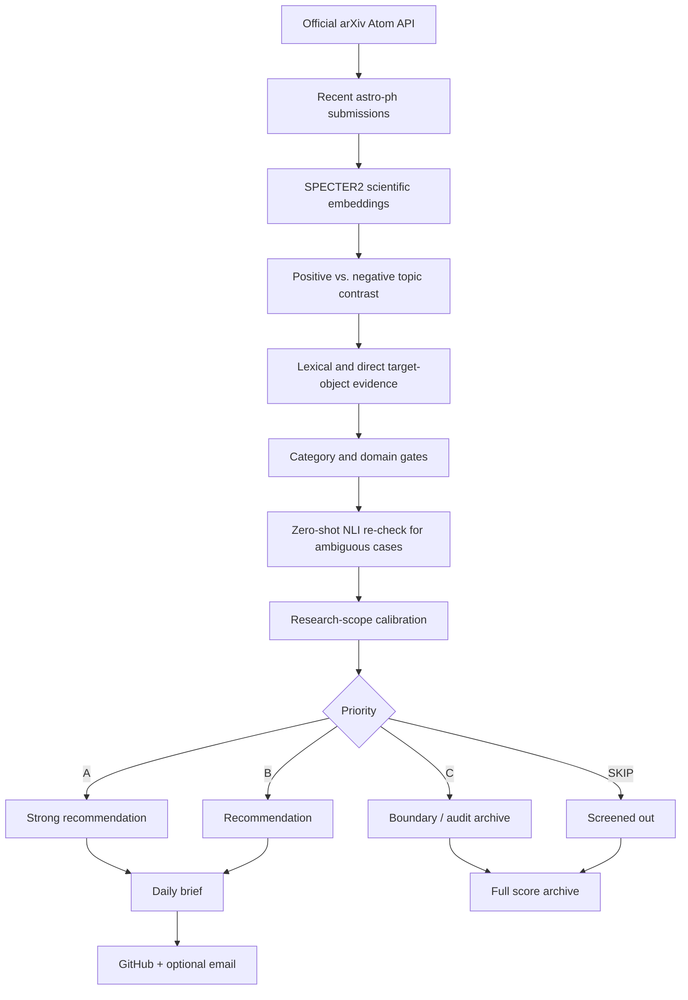

# AstroBrief

**Semantic arXiv screening and daily literature briefs for astronomy research groups.**

AstroBrief automatically retrieves recent `astro-ph` submissions from the **official arXiv Atom API**, evaluates each paper against a configurable research scope, ranks the candidates with scientific-language models and explicit domain guards, then delivers a compact research brief by GitHub and, optionally, email.

The default profile is tuned for **Galactic/local interstellar medium (ISM), molecular clouds, cold atomic and molecular gas, dense structures, star formation, turbulence, magnetic fields, chemistry, feedback, high-velocity clouds (HVCs), gaseous halos, and the circumgalactic medium (CGM)**. The research scope is configurable through `semantic_topics.json`.

AstroBrief runs entirely in **GitHub Actions**. It does not require a continuously running local computer or a paid LLM/model API.

## Why AstroBrief?

A simple keyword alert often has two problems:

1. **False positives:** generic terms such as *shock*, *turbulence*, *feedback*, *magnetic field*, or *halo* also occur in solar, planetary, compact-object, stellar-dynamics, plasma, and unrelated extragalactic papers that may be outside the group's scope.
2. **False negatives:** a relevant paper may describe the science using different terminology, appear as a cross-list, or have a primary category that does not obviously match the target topic.

AstroBrief therefore treats paper selection as a **semantic ranking and scope-classification problem**, rather than substring matching alone.

## Pipeline overview



## How it works

### 1. Official arXiv ingestion

AstroBrief queries:

```text
https://export.arxiv.org/api/query
```

using the Atom API and a date-bounded `astro-ph.*` category query. It reads structured metadata directly from the Atom feed: arXiv ID, title, abstract, authors, categories, and primary category.

This avoids depending on the HTML structure of the `/list/astro-ph/new` webpage. Category-based ingestion also naturally captures relevant `astro-ph` cross-lists in the candidate pool.

### 2. Configurable research scope

`semantic_topics.json` defines the scientific scope. It contains:

- **positive topics** — scientific directions the group wants to see;
- **topic descriptions** — natural-language descriptions used for semantic comparison;
- **lexical cues** — high-value terminology that provides additional domain evidence;
- **negative/background domains** — common nearby fields that should not be promoted merely because they share generic terminology;
- **scope information** — rules used to calibrate the final priorities for the intended research group.

The default positive profile currently includes atomic ISM, molecular clouds, star formation, feedback and bubbles, turbulence, magnetic fields, astrochemistry, massive-star formation, Galactic ISM, **HVC / halo gas / CGM**, and directly relevant ISM methods.

This configuration is a **stable semantic profile**, not a daily training set. For a group with reasonably stable interests, it normally needs attention only when research directions change or when repeated false positives/negatives reveal a useful adjustment.

### 3. SPECTER2 semantic representation

The main scientific representation uses **AllenAI SPECTER2**, a model designed for scientific documents. AstroBrief embeds paper title + abstract and compares papers with the configured scientific topics.

The system uses semantic similarity together with a positive-vs-negative contrast, rather than treating a high similarity to one broad scientific phrase as sufficient evidence by itself.

### 4. Lexical and object-level evidence

Semantic similarity is supplemented by explicit domain evidence such as molecular clouds, neutral hydrogen, HISA/HINSA, dense cores, IRDCs, H II regions, the CMZ, HVCs/IVCs, the Magellanic Stream, halo gas, the CGM, molecular-line observations, and other target-domain indicators.

This layer is intentionally different from a traditional keyword filter: lexical evidence **supports or constrains** a semantic decision rather than being the sole selection mechanism. Ambiguous phrases are treated conservatively; for example, `Galactic halo` by itself is not considered halo-gas evidence unless the title also contains an explicit gas context.

### 5. Category and negative-domain gates

AstroBrief examines the primary arXiv category and the strongest competing domain. Papers dominated by areas such as solar physics, stellar evolution, planetary disks, compact objects, generic MHD/plasma physics, IGM/reionization, or instrumentation require stronger direct target-object evidence before they can be promoted.

This is designed to suppress papers that are semantically close only because they share broad physical vocabulary.

### 6. Zero-shot NLI for ambiguous cases

A small local **zero-shot natural-language-inference (NLI)** model re-checks uncertain candidates. It compares whether the abstract is better supported by the configured ISM/star-formation/halo-gas interpretation or a competing non-target interpretation.

The NLI stage can demote ambiguous false positives and rescue conservative near-misses when there is strong direct scientific evidence.

### 7. Final scope calibration

The last stage applies research-group scope rules. This is where a scientifically valid astronomy paper can still be treated as secondary if it falls outside the group's intended working domain, while high-value Galactic/local ISM, HVC, halo-gas, and CGM cases can be preserved.

The current default profile is deliberately centered on ISM, star formation, and gaseous-halo/CGM science; users should revise `semantic_topics.json` when adapting AstroBrief to another field.

## Priority system

Each candidate receives one final priority:

| Priority | Meaning | Default delivery |
| --- | --- | --- |
| **A** | Strong match to the target research scope | Included in daily brief/email |
| **B** | Relevant and worth reading | Included in daily brief/email |
| **C** | Boundary candidate useful for recall/auditing | Archived, not emailed as a recommendation |
| **SKIP** | Outside the configured scope | Retained only in the full score archive |

A/B are therefore the operational recommendations; C and SKIP make the system auditable rather than hiding every rejected decision.

## Outputs

A production run generates:

- `LATEST.md` — latest human-readable AstroBrief recommendation report;
- `briefs/YYYY-MM-DD.md` — dated human-readable brief archive;
- `scores/YYYY-MM-DD.json` — full scored candidate pool and diagnostic fields;
- a GitHub Issue containing the human-readable report;
- an optional HTML/plain-text email containing the A/B recommendations.

The JSON archive is particularly useful when tuning the scope because it preserves the model scores, evidence, priorities, and classification reasons for the complete candidate pool.

## Main files

| File | Purpose |
| --- | --- |
| `daily.py` | Standalone production entry point and output orchestration |
| `semantic_daily.py` | Official arXiv Atom ingestion, report generation, email delivery, final scope guard |
| `semantic_recommender.py` | SPECTER2 scoring, domain evidence, NLI classification, priority logic |
| `semantic_topics.json` | Research-scope and topic configuration |
| `semantic_smoke_test.py` | Regression/smoke tests for the recommendation behaviour |
| `github_issue.py` | Repository-independent GitHub Issue helper |
| `.github/workflows/daily_arxiv.yml` | Scheduled AstroBrief production workflow |
| `.github/workflows/semantic_production_test.yml` | CI smoke-test workflow |

## Quick start on GitHub

### 1. Create a repository

Create a new GitHub repository and copy the AstroBrief files into it. Inside GitHub Actions, the code detects `GITHUB_REPOSITORY` automatically, so the repository owner/name do not need to be hard-coded.

### 2. Configure the research scope

Edit `semantic_topics.json` to match the science you want to receive.

For best results, write topic descriptions as real scientific descriptions rather than long bags of keywords. Keep explicit negative/background domains where generic terminology could otherwise create contamination.

### 3. Configure email delivery (optional)

In **Settings → Secrets and variables → Actions**, add:

| Repository secret | Meaning |
| --- | --- |
| `SMTP_USERNAME` | SMTP login / sending account |
| `SMTP_PASSWORD` | SMTP password or app password |
| `SMTP_FROM` | From address |
| `EMAIL_TO` | Recipient address(es) |

The supplied workflow is configured for Gmail SMTP (`smtp.gmail.com`, port `465`). Gmail users should use an **App Password** rather than the normal account password.

If SMTP secrets are omitted, AstroBrief can still score papers, write the GitHub archive, and create the report.

### 4. Enable GitHub Actions

The default production workflow runs on weekdays at **09:30 Beijing time (UTC 01:30)** and supports manual execution through **Actions → AstroBrief Daily → Run workflow**.

Edit `.github/workflows/daily_arxiv.yml` if you want another schedule.

### 5. Run the smoke test

Before changing model names, ranking thresholds, or the scope configuration substantially, run the included CI workflow or execute:

```bash
python semantic_smoke_test.py
```

## Local development

Python **3.11** is recommended.

```bash
pip install -r requirements.txt
python semantic_smoke_test.py
python daily.py
```

A local scoring run does not require a paid model API. GitHub Issue creation and SMTP delivery require their respective credentials/environment variables.

## Models and dependencies

The default recommendation engine uses:

- **Scientific embeddings:** `allenai/specter2_base` with SPECTER2 query/proximity adapters;
- **Ambiguous-case NLI:** `cross-encoder/nli-deberta-v3-xsmall`;
- **Model runtime:** PyTorch, Transformers, Adapters;
- **Data source:** official arXiv Atom API;
- **Automation:** GitHub Actions.

Models are downloaded from Hugging Face and cached by GitHub Actions. The first run is therefore heavier because it must download the model files; later runs can restore the cache.

## What AstroBrief does not do

- It does **not** retrain SPECTER2 or the NLI model every day.
- It does **not** require OpenAI, Anthropic, Gemini, or another paid LLM API.
- It does **not** rely on the arXiv HTML page structure for production ingestion.
- It does **not** assume every semantically similar paper belongs to the target research scope; explicit evidence and domain guards remain part of the decision.

## Limitations

AstroBrief is a research-assistance system, not a complete bibliographic database or an infallible classifier.

- Ranking thresholds are empirically tuned and should be revalidated when the scientific scope changes substantially.
- Semantic models can still produce false positives and false negatives.
- The default scope contains deliberate ISM/star-formation/halo-gas assumptions and should not be reused unchanged for an unrelated field.
- arXiv metadata and submission-date behaviour define the candidate pool; AstroBrief does not independently verify journal publication status.
- The current system does not learn automatically from user clicks or reading behaviour. Feedback-driven personalization is a possible future extension.

## Possible extensions

- separate topic profiles for different group members;
- per-recipient recommendation emails;
- representative-paper prototypes;
- explicit thumbs-up / thumbs-down feedback;
- weekly or monthly digests;
- author/watch-list signals;
- a lightweight web dashboard;
- automatic evaluation sets for monitoring precision and recall over time.

## Project history and acknowledgements

**AstroBrief began as an experimental fork of [`olozhika/ArXivDaily_StarFormation`](https://github.com/olozhika/ArXivDaily_StarFormation). We gratefully acknowledge Xing Yuchen (`olozhika`) and the original project for providing the starting point and inspiration for an automated arXiv literature workflow.**

The current standalone architecture was subsequently redesigned around a different production pipeline: official **arXiv Atom API** ingestion replaces HTML-page scraping; the original keyword include/exclude selection is replaced by the **SPECTER2 + domain-evidence + zero-shot NLI semantic recommendation system**; and the project adds scoped priority ranking, full score auditing, model caching, smoke tests, SMTP delivery, and repository-independent GitHub Actions automation.

This history is kept explicitly in the README so that the origin of the project remains visible even when AstroBrief is distributed as a fresh, non-fork repository.

AstroBrief also relies on and gratefully acknowledges **arXiv**, **AllenAI SPECTER2**, **Hugging Face**, **Transformers**, **Adapters**, **PyTorch**, and **GitHub Actions**.

## Project status

AstroBrief is an independent, non-fork repository. Its production pipeline has been exercised end-to-end with official arXiv ingestion, semantic recommendation, score archiving, GitHub Issue generation, and SMTP delivery. The HVC / halo-gas / CGM scope extension includes explicit regression coverage for target papers versus common halo/IGM false positives.
